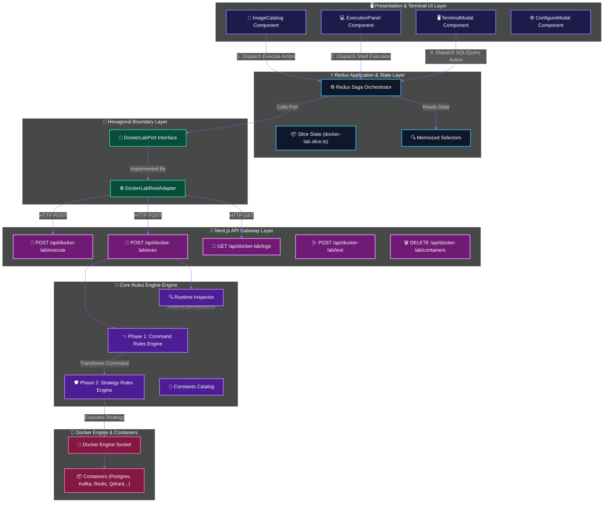
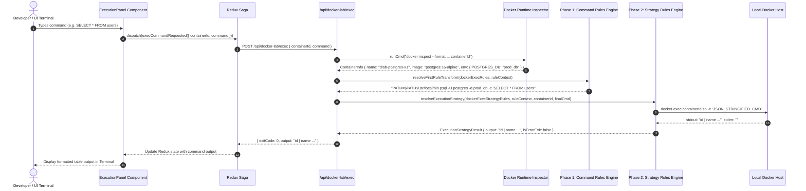

# Docker Lab Extreme-Scale Architecture & Multi-Phase Rules Engine

## Table of Contents
1. [Executive Summary & Core Objectives](#1-executive-summary--core-objectives)
2. [High-Level Design (HLD)](#2-high-level-design-hld)
   - [2.1 Detailed System Component & Data Flow Architecture](#21-detailed-system-component--data-flow-architecture)
   - [2.2 Hexagonal Ports & Adapters Architecture](#22-hexagonal-ports--adapters-architecture)
   - [2.3 End-to-End Execution Sequence Diagram](#23-end-to-end-execution-sequence-diagram)
   - [2.4 Live Container Lifecycle & Dynamic Environment Inspection](#24-live-container-lifecycle--dynamic-environment-inspection)
3. [Low-Level Design (LLD)](#3-low-level-design-lld)
   - [3.1 Two-Phase Rules Engine Execution Decision Tree](#31-two-phase-rules-engine-execution-decision-tree)
   - [3.2 Constants Architecture & Schema Definitions](#32-constants-architecture--schema-definitions)
   - [3.3 Phase 1: Command Transformation Rules Engine](#33-phase-1-command-transformation-rules-engine)
   - [3.4 Phase 2: Execution Strategy & Post-Processing Engine](#34-phase-2-execution-strategy--post-processing-engine)
   - [3.5 API Route Specifications](#35-api-route-specifications)
4. [Detailed Rule Matrix for All 47+ Infrastructure Images](#4-detailed-rule-matrix-for-all-47-infrastructure-images)
5. [Complete Core Algorithms & Pseudocodes](#5-complete-core-algorithms--pseudocodes)
   - [Algorithm 1: `resolveFirstRuleTransform`](#algorithm-1-resolvefirstruletransform)
   - [Algorithm 2: `resolveExecutionStrategy`](#algorithm-2-resolveexecutionstrategy)
   - [Algorithm 3: `inspectContainer`](#algorithm-3-inspectcontainer)
   - [Algorithm 4: API Endpoint Pipeline](#algorithm-4-api-endpoint-pipeline)
6. [Production Verification & Maintenance](#6-production-verification--maintenance)

---

## 1. Executive Summary & Core Objectives

The **Docker Lab Engine** within `infra-gateway` provides an interactive, zero-lock-in orchestration and debugging platform for 47+ enterprise infrastructure Docker images across 8 major domains (Databases, Messaging, Observability, Search Engines, Proxy & Gateways, Security & Identity, AI & Vector DBs, and Dev/Cloud Infrastructure).

### Key Architectural Pillars:
1. **Zero Hardcoded Assumptions**: All database names, usernames, passwords, port mappings, and credentials are dynamically inspected at runtime via `docker inspect`.
2. **Dual-Phase Declarative Rules Engine**: Command processing is split into Phase 1 (Command Syntax & CLI Transformation) and Phase 2 (Base Image Execution Strategy & Error Exit Determination).
3. **Hexagonal Architecture**: Absolute separation between Domain (Entities, Catalog), Ports (Interfaces), Adapters (REST HTTP, Docker CLI facade), Application (Sagas, Slice, Selectors), and UI Components.
4. **Universal Native CLI Routing**: Every container command automatically leverages native tools (`psql`, `mysql`, `clickhouse-client`, `redis-cli`, `mongosh`, `kafka-topics.sh`, `cqlsh`, `awslocal`, `kc.sh`, `vault`, etc.).

---

## 2. High-Level Design (HLD)

### 2.1 Detailed System Component & Data Flow Architecture



### 2.2 Hexagonal Ports & Adapters Architecture

```mermaid
%%{init: {'theme': 'dark', 'themeVariables': { 'primaryColor': '#064e3b', 'primaryTextColor': '#ffffff', 'primaryBorderColor': '#34d399', 'lineColor': '#38bdf8'}}}%%
graph LR
    classDef driverStyle fill:#1e1b4b,stroke:#818cf8,stroke-width:2px,color:#fff;
    classDef portStyle fill:#0f172a,stroke:#38bdf8,stroke-width:2px,color:#fff;
    classDef domainStyle fill:#4c1d95,stroke:#c084fc,stroke-width:2px,color:#fff;
    classDef drivenStyle fill:#701a75,stroke:#f0abfc,stroke-width:2px,color:#fff;

    subgraph Drivers["📥 Driving Drivers (User Actions)"]
        WebUI["🖥️ React Web Application UI"]:::driverStyle
        CLITerminal["🐚 Interactive Terminal Modal"]:::driverStyle
    end

    subgraph Application["🏰 Hexagonal Core Architecture"]
        subgraph Ports["🔌 Inbound Port Contracts"]
            InboundPort["DockerLabPort (Port Interface)"]:::portStyle
        end
        subgraph Domain["💎 Domain Engine Core"]
            Entities["DockerImage Entity Model"]:::domainStyle
            Catalog["DOCKER_IMAGES_CATALOG"]:::domainStyle
            RulesEngine["Dual-Phase Rules Engine"]:::domainStyle
        end
    end

    subgraph Driven["📤 Driven Adapters (Infrastructure)"]
        RESTAdapter["🌐 DockerLabRestAdapter"]:::drivenStyle
        DockerCLI["🐳 Docker CLI Child Process Facade"]:::drivenStyle
    end

    Drivers -->|Invoke Methods| InboundPort
    InboundPort -->|Implemented By| RESTAdapter
    RESTAdapter -->|Evaluate Rules| Domain
    Domain -->|Execute System Call| DockerCLI
```



### 2.3 End-to-End Sequence Diagram



### 2.4 Live Container Lifecycle & Dynamic Environment Inspection

```mermaid
flowchart TD
    classDef startStyle fill:#15803d,stroke:#4ade80,stroke-width:2px,color:#fff;
    classDef processStyle fill:#0369a1,stroke:#38bdf8,stroke-width:2px,color:#fff;
    classDef decisionStyle fill:#a21caf,stroke:#f0abfc,stroke-width:2px,color:#fff;
    classDef cleanStyle fill:#b91c1c,stroke:#f87171,stroke-width:2px,color:#fff;

    Start([🚀 User Clicks 'Execute Selected']):::startStyle --> BuildRunCmd[🔨 Build docker run Command with Port Allocation]:::processStyle
    BuildRunCmd --> ExecDockerRun[🐳 Execute `docker run -d --name dlab-image-xxxx`]:::processStyle
    ExecDockerRun --> InspectID[🔍 Run `docker inspect --format '{{.ID}}'`]:::processStyle
    InspectID --> GetShortID[🔑 Extract 12-character Hex Container ID]:::processStyle
    GetShortID --> StartLogPoll[📜 Initiate Polling `GET /api/docker-lab/logs`]:::processStyle
    GetShortID --> ProbeHealth[🩺 Run Health Probe `POST /api/docker-lab/test`]:::processStyle
    
    ProbeHealth --> CheckStatus{Status Health Check Passed?}:::decisionStyle
    CheckStatus -- Yes --> MarkRunning[🟢 Set Container Status: 'running']:::processStyle
    CheckStatus -- No --> RetryProbe[🔄 Retry Health Check Probe]:::processStyle
    RetryProbe --> MarkRunning

    MarkRunning --> ExecUserCmd[🐚 Developer Submits Command]:::processStyle
    ExecUserCmd --> InspectEnv[🔍 Inspect Environment Variables dynamically]:::processStyle
    InspectEnv --> Phase1Transform[✨ Phase 1 Transformation: psql, mysql, redis-cli...]:::processStyle
    Phase1Transform --> Phase2Strategy[🛡️ Phase 2 Strategy: Distroless vs Shell Execution]:::processStyle
    Phase2Strategy --> ReturnOutput[📊 Return Result JSON to UI]:::processStyle

    ReturnOutput --> UserDelete[🛑 User Deletes Container]:::processStyle
    UserDelete --> ExecDockerRM[🧹 Execute `docker rm -f containerId`]:::cleanStyle
    ExecDockerRM --> StopLogs[🛑 Return Empty Array `[]` for Logs API]:::cleanStyle
    StopLogs --> End([🏁 Container Safely Stopped & Cleaned]):::cleanStyle
```

---

## 3. Low-Level Design (LLD)

### 3.1 Two-Phase Rules Engine Execution Decision Tree

```mermaid
flowchart TD
    classDef inputStyle fill:#1e1b4b,stroke:#818cf8,stroke-width:2px,color:#fff;
    classDef p1Style fill:#064e3b,stroke:#34d399,stroke-width:2px,color:#fff;
    classDef p2Style fill:#701a75,stroke:#f0abfc,stroke-width:2px,color:#fff;
    classDef outputStyle fill:#15803d,stroke:#4ade80,stroke-width:2px,color:#fff;

    Input([📥 Incoming Payload: containerId, rawCommand]):::inputStyle --> Inspect[🔍 Inspect Container via docker inspect]:::inputStyle
    Inspect --> CreateCtx[📋 Create RuleContext: name, image, env, rawCommand, isSql]:::inputStyle
    
    CreateCtx --> Phase1Filter[✨ Filter Active Rules: rule.enabled == true]:::p1Style
    Phase1Filter --> Phase1Sort[🔢 Sort Rules by Priority Descending: 100 -> 10]:::p1Style
    Phase1Sort --> Phase1Loop{Match Rule Condition}:::p1Style
    
    Phase1Loop -- Postgres SQL --> TransformPostgres[🐘 Transform: psql -U pgUser -d pgDb -c "SQL"]:::p1Style
    Phase1Loop -- MySQL SQL --> TransformMySQL[🐬 Transform: mysql -u user -pPass -e "SQL"]:::p1Style
    Phase1Loop -- Redis Cmd --> TransformRedis[🔴 Transform: redis-cli cmd]:::p1Style
    Phase1Loop -- Mongo Cmd --> TransformMongo[🍃 Transform: mongosh --eval "query"]:::p1Style
    Phase1Loop -- Kafka Cmd --> TransformKafka[🚀 Transform: kafka-topics.sh --list]:::p1Style
    Phase1Loop -- Fallback --> TransformFallback[⚙️ Transform: PATH=$PATH:/opt/kafka/bin...]:::p1Style

    TransformPostgres --> Phase2Start[🛡️ Pass Transformed Command to Phase 2 Execution Strategy]:::p2Style
    TransformMySQL --> Phase2Start
    TransformRedis --> Phase2Start
    TransformMongo --> Phase2Start
    TransformKafka --> Phase2Start
    TransformFallback --> Phase2Start

    Phase2Start --> CheckStrategy{Matched Strategy Rule}:::p2Style
    CheckStrategy -- Postgres Rule --> StrategyPostgres[🐘 Execute PostgreSQL Strategy & Check Error Signatures]:::p2Style
    CheckStrategy -- MySQL Rule --> StrategyMySQL[🐬 Execute MySQL Strategy & Check Error Signatures]:::p2Style
    CheckStrategy -- Redis Rule --> StrategyRedis[🔴 Execute Redis Strategy & Check Error Codes]:::p2Style
    CheckStrategy -- Distroless Rule --> StrategyDirect[⚡ Direct Execution Strategy: docker exec containerId finalCmd]:::p2Style
    CheckStrategy -- Shell Fallback Rule --> StrategyShell[🐚 Shell Wrapper Strategy: docker exec containerId sh -c JSON_CMD]:::p2Style
    
    StrategyPostgres --> EvaluateOutput[📊 Evaluate Exit Code & Response Output]:::outputStyle
    StrategyMySQL --> EvaluateOutput
    StrategyRedis --> EvaluateOutput
    StrategyDirect --> EvaluateOutput
    StrategyShell --> EvaluateOutput

    EvaluateOutput --> BuildResponse([📊 Return Result JSON { exitCode, output }]):::outputStyle
```

### 3.2 Constants Architecture & Schema Definitions

All identifiers and categories are declared as immutable const maps in `src/features/docker-lab/constants/docker-lab.constants.ts`:

```typescript
export const IMAGE_IDS = {
  REDIS: "redis", POSTGRES: "postgres", MYSQL: "mysql", MARIADB: "mariadb",
  MONGODB: "mongodb", INFLUXDB: "influxdb", CASSANDRA: "cassandra", COCKROACHDB: "cockroachdb",
  TIMESCALEDB: "timescaledb", SCYLLADB: "scylladb", SURREALDB: "surrealdb", CLICKHOUSE: "clickhouse",
  NEO4J: "neo4j", QDRANT: "qdrant", MILVUS: "milvus", WEAVIATE: "weaviate", CHROMA: "chroma",
  KAFKA: "kafka", RABBITMQ: "rabbitmq", NATS: "nats", PULSAR: "pulsar", ZOOKEEPER: "zookeeper",
  SCHEMA_REGISTRY: "schema-registry", KAFKA_UI: "kafka-ui", MOSQUITTO: "mosquitto",
  GRAFANA: "grafana", PROMETHEUS: "prometheus", JAEGER: "jaeger", TEMPO: "tempo", LOKI: "loki",
  OPENTELEMETRY_COLLECTOR: "opentelemetry-collector", ZIPKIN: "zipkin", ALERTMANAGER: "alertmanager",
  VECTOR: "vector", ELASTICSEARCH: "elasticsearch", KIBANA: "kibana", OPENSEARCH: "opensearch",
  MEILISEARCH: "meilisearch", TYPESENSE: "typesense", NGINX: "nginx", TRAEFIK: "traefik",
  ENVOY: "envoy", HAPROXY: "haproxy", CADDY: "caddy", KONG: "kong", VAULT: "vault",
  KEYCLOAK: "keycloak", ORY_KRATOS: "ory-kratos", MINIO: "minio", JENKINS: "jenkins",
  CONSUL: "consul", ETCD: "etcd", LOCALSTACK: "localstack"
} as const;

export const CATEGORIES = {
  DATABASES: "Databases", MESSAGING: "Messaging & Streaming",
  OBSERVABILITY: "Observability & Tracing", SEARCH: "Search Engines",
  PROXY: "Proxy & Gateway", SECURITY: "Security & Identity",
  AI_VECTOR: "AI & Vector DBs", INFRASTRUCTURE: "Dev & Infrastructure"
} as const;
```

### 3.3 Phase 1: Command Transformation Rules Engine

Commands pass through `resolveFirstRuleTransform(dockerExecRules, ruleContext)`:
- Rule priorities range from `100` (Critical image match) to `10` (Fallback PATH expansion).
- Standardizes raw user input, SQL queries, and CLI invocations into fully formatted shell commands.

### 3.4 Phase 2: Execution Strategy & Post-Processing Engine

Evaluated by `resolveExecutionStrategy(dockerExecStrategyRules, ruleContext, containerId, finalCmd)`:
- Image-specific strategy rules (`rule-strategy-postgres`, `rule-strategy-mysql-mariadb`, `rule-strategy-mongo`, `rule-strategy-redis`, `rule-strategy-kafka`, `rule-strategy-elasticsearch`, `rule-strategy-distroless`, `rule-strategy-standard-shell`).
- Handles distroless images (e.g. SurrealDB) that lack `/bin/sh` by executing directly.
- Evaluates exit codes based on image-specific error signatures (`psql: error:`, `ERROR 1045`, `MongoServerError`, `(error) ERR`).

---

## 4. Detailed Rule Matrix for All 47+ Infrastructure Images

| Image ID | Category | Official Docker Hub URL | Native CLI / Health Target | Transformation & Strategy Rule |
|---|---|---|---|---|
| `redis` | Databases | `https://hub.docker.com/_/redis` | `redis-cli` | `rule-redis` / `rule-strategy-redis` |
| `postgres` | Databases | `https://hub.docker.com/_/postgres` | `psql` | `rule-postgres` / `rule-strategy-postgres` |
| `mysql` | Databases | `https://hub.docker.com/_/mysql` | `mysql` | `rule-mysql` / `rule-strategy-mysql-mariadb` |
| `mariadb` | Databases | `https://hub.docker.com/_/mariadb` | `mariadb` | `rule-mariadb` / `rule-strategy-mysql-mariadb` |
| `mongodb` | Databases | `https://hub.docker.com/_/mongo` | `mongosh` / `mongo` | `rule-mongodb` / `rule-strategy-mongo` |
| `clickhouse` | Databases | `https://hub.docker.com/r/clickhouse/clickhouse-server` | `clickhouse-client` | `rule-clickhouse` / `rule-strategy-standard-shell` |
| `surrealdb` | Databases | `https://hub.docker.com/r/surrealdb/surrealdb` | `/surreal` | `rule-surrealdb` / `rule-strategy-distroless` |
| `cassandra` | Databases | `https://hub.docker.com/_/cassandra` | `cqlsh` | `rule-cassandra` / `rule-strategy-standard-shell` |
| `cockroachdb` | Databases | `https://hub.docker.com/r/cockroachdb/cockroach` | `cockroach sql` | `rule-cockroachdb` / `rule-strategy-standard-shell` |
| `timescaledb` | Databases | `https://hub.docker.com/r/timescale/timescaledb` | `psql` | `rule-timescaledb` / `rule-strategy-postgres` |
| `scylladb` | Databases | `https://hub.docker.com/r/scylladb/scylla` | `cqlsh` | `rule-scylladb` / `rule-strategy-standard-shell` |
| `influxdb` | Databases | `https://hub.docker.com/_/influxdb` | `influx` | `rule-influxdb` / `rule-strategy-standard-shell` |
| `neo4j` | Databases | `https://hub.docker.com/_/neo4j` | `cypher-shell` | `rule-neo4j` / `rule-strategy-standard-shell` |
| `qdrant` | AI & Vector DBs | `https://hub.docker.com/r/qdrant/qdrant` | `/readyz` | `rule-qdrant` / `rule-strategy-standard-shell` |
| `milvus` | AI & Vector DBs | `https://hub.docker.com/r/milvusdb/milvus` | `/healthz` | `rule-milvus` / `rule-strategy-standard-shell` |
| `weaviate` | AI & Vector DBs | `https://hub.docker.com/r/semitechnologies/weaviate` | `/v1/.well-known/ready` | `rule-weaviate` / `rule-strategy-standard-shell` |
| `chroma` | AI & Vector DBs | `https://hub.docker.com/r/chromadb/chroma` | `/api/v1/heartbeat` | `rule-chroma` / `rule-strategy-standard-shell` |
| `kafka` | Messaging | `https://hub.docker.com/r/apache/kafka` | `kafka-topics.sh` | `rule-kafka` / `rule-strategy-kafka` |
| `rabbitmq` | Messaging | `https://hub.docker.com/_/rabbitmq` | `rabbitmqctl` | `rule-rabbitmq` / `rule-strategy-standard-shell` |
| `pulsar` | Messaging | `https://hub.docker.com/r/apachepulsar/pulsar` | `pulsar-admin` | `rule-pulsar` / `rule-strategy-standard-shell` |
| `nats` | Messaging | `https://hub.docker.com/_/nats` | `nats-server` | `rule-nats` / `rule-strategy-standard-shell` |
| `zookeeper` | Messaging | `https://hub.docker.com/_/zookeeper` | `zkCli.sh` | `rule-zookeeper` / `rule-strategy-standard-shell` |
| `schema-registry` | Messaging | `https://hub.docker.com/r/confluentinc/cp-schema-registry` | `/subjects` | `rule-schema-registry` / `rule-strategy-standard-shell` |
| `kafka-ui` | Messaging | `https://hub.docker.com/r/provectuslabs/kafka-ui` | `/actuator/health` | `rule-kafka-ui` / `rule-strategy-standard-shell` |
| `mosquitto` | Messaging | `https://hub.docker.com/_/eclipse-mosquitto` | `mosquitto_sub` | `rule-mosquitto` / `rule-strategy-standard-shell` |
| `grafana` | Observability | `https://hub.docker.com/r/grafana/grafana` | `grafana-cli` | `rule-grafana` / `rule-strategy-standard-shell` |
| `prometheus` | Observability | `https://hub.docker.com/r/prom/prometheus` | `promtool` | `rule-prometheus` / `rule-strategy-standard-shell` |
| `jaeger` | Observability | `https://hub.docker.com/r/jaegertracing/all-in-one` | UI Port 16686 | `rule-jaeger` / `rule-strategy-standard-shell` |
| `tempo` | Observability | `https://hub.docker.com/r/grafana/tempo` | `/ready` | `rule-tempo` / `rule-strategy-standard-shell` |
| `loki` | Observability | `https://hub.docker.com/r/grafana/loki` | `/ready` | `rule-loki` / `rule-strategy-standard-shell` |
| `opentelemetry-collector` | Observability | `https://hub.docker.com/r/otel/opentelemetry-collector-contrib` | `otelcol-contrib` | `rule-opentelemetry-collector` / `rule-strategy-standard-shell` |
| `zipkin` | Observability | `https://hub.docker.com/r/openzipkin/zipkin` | `/health` | `rule-zipkin` / `rule-strategy-standard-shell` |
| `alertmanager` | Observability | `https://hub.docker.com/r/prom/alertmanager` | `alertmanager` | `rule-alertmanager` / `rule-strategy-standard-shell` |
| `vector` | Observability | `https://hub.docker.com/r/timberio/vector` | `vector` | `rule-vector` / `rule-strategy-standard-shell` |
| `elasticsearch` | Search Engines | `https://hub.docker.com/_/elasticsearch` | `/_cluster/health` | `rule-elasticsearch` / `rule-strategy-elasticsearch` |
| `kibana` | Search Engines | `https://hub.docker.com/_/kibana` | `/api/status` | `rule-kibana` / `rule-strategy-standard-shell` |
| `opensearch` | Search Engines | `https://hub.docker.com/r/opensearchproject/opensearch` | HTTP Port 9200 | `rule-opensearch` / `rule-strategy-elasticsearch` |
| `meilisearch` | Search Engines | `https://hub.docker.com/r/getmeili/meilisearch` | `/health` | `rule-meilisearch` / `rule-strategy-standard-shell` |
| `typesense` | Search Engines | `https://hub.docker.com/r/typesense/typesense` | `/health` | `rule-typesense` / `rule-strategy-standard-shell` |
| `nginx` | Proxy & Gateway | `https://hub.docker.com/_/nginx` | `nginx` | `rule-nginx` / `rule-strategy-standard-shell` |
| `traefik` | Proxy & Gateway | `https://hub.docker.com/_/traefik` | `traefik` | `rule-traefik` / `rule-strategy-standard-shell` |
| `envoy` | Proxy & Gateway | `https://hub.docker.com/r/envoyproxy/envoy` | `envoy` | `rule-envoy` / `rule-strategy-standard-shell` |
| `haproxy` | Proxy & Gateway | `https://hub.docker.com/_/haproxy` | `haproxy` | `rule-haproxy` / `rule-strategy-standard-shell` |
| `caddy` | Proxy & Gateway | `https://hub.docker.com/_/caddy` | `caddy` | `rule-caddy` / `rule-strategy-standard-shell` |
| `kong` | Proxy & Gateway | `https://hub.docker.com/_/kong` | `kong` | `rule-kong` / `rule-strategy-standard-shell` |
| `vault` | Security & Identity | `https://hub.docker.com/_/vault` | `vault` | `rule-vault` / `rule-strategy-standard-shell` |
| `keycloak` | Security & Identity | `https://hub.docker.com/r/quay.io/keycloak/keycloak` | `/opt/keycloak/bin/kc.sh` | `rule-keycloak` / `rule-strategy-standard-shell` |
| `ory-kratos` | Security & Identity | `https://hub.docker.com/r/oryd/kratos` | `kratos` | `rule-ory-kratos` / `rule-strategy-distroless` |
| `minio` | Dev & Infrastructure | `https://hub.docker.com/r/minio/minio` | `minio` | `rule-minio` / `rule-strategy-standard-shell` |
| `jenkins` | Dev & Infrastructure | `https://hub.docker.com/r/jenkins/jenkins` | `jenkins-plugin-cli` | `rule-jenkins` / `rule-strategy-standard-shell` |
| `consul` | Dev & Infrastructure | `https://hub.docker.com/_/consul` | `consul` | `rule-consul` / `rule-strategy-standard-shell` |
| `etcd` | Dev & Infrastructure | `https://hub.docker.com/r/bitnami/etcd` | `etcdctl` | `rule-etcd` / `rule-strategy-standard-shell` |
| `localstack` | Dev & Infrastructure | `https://hub.docker.com/r/localstack/localstack` | `awslocal` | `rule-localstack` / `rule-strategy-standard-shell` |

---

## 5. Complete Core Algorithms & Pseudocodes

### Algorithm 1: `resolveFirstRuleTransform`
```typescript
/**
 * PSEUDOCODE: Phase 1 Command Transformation Resolution
 * Input: rules: Rule[], ctx: RuleContext
 * Output: Transformed shell command string
 */
function resolveFirstRuleTransform(rules: Rule[], ctx: RuleContext): string {
    const activeRules = rules
        .filter(r => r.enabled === true)
        .sort((a, b) => b.priority - a.priority);

    for (const rule of activeRules) {
        if (rule.condition(ctx) === true) {
            if (rule.asyncCheck != null) {
                const asyncOk = await rule.asyncCheck(ctx);
                if (!asyncOk) continue;
            }
            return rule.transform(ctx);
        }
    }
    return ctx.rawCommand;
}
```

### Algorithm 2: `resolveExecutionStrategy`
```typescript
/**
 * PSEUDOCODE: Phase 2 Execution Strategy & Post-Processing
 * Input: strategyRules: ExecutionStrategyRule[], ctx: RuleContext, containerId: string, finalCmd: string
 * Output: ExecutionStrategyResult { stdout, stderr, isErrorExit, output }
 */
function resolveExecutionStrategy(
    strategyRules: ExecutionStrategyRule[],
    ctx: RuleContext,
    containerId: string,
    finalCmd: string
): ExecutionStrategyResult {
    const active = strategyRules
        .filter(r => r.enabled === true)
        .sort((a, b) => b.priority - a.priority);

    for (const rule of active) {
        if (rule.condition(ctx) === true) {
            return await rule.execute(ctx, containerId, finalCmd);
        }
    }
    return await defaultFallbackStrategy(ctx, containerId, finalCmd);
}
```

### Algorithm 3: `inspectContainer`
```typescript
/**
 * PSEUDOCODE: Live Container Dynamic Inspection
 * Input: containerId: string
 * Output: ContainerInfo { name, image, env }
 */
function inspectContainer(containerId: string): ContainerInfo {
    const rawOut = await runCmd(`docker inspect --format '{{.Name}}|{{.Config.Image}}|{{range .Config.Env}}{{.}};{{end}}' ${containerId}`);
    const parts = rawOut.stdout.trim().split("|");
    
    const name = parts[0].replace(/^\//, "");
    const image = parts[1];
    const envEntries = parts[2].split(";").filter(Boolean);
    
    const envMap = {};
    for (const entry of envEntries) {
        const [key, val] = entry.split("=");
        if (key) envMap[key] = val;
    }
    
    return { name, image, env: envMap };
}
```

### Algorithm 4: API Endpoint Pipeline
```typescript
/**
 * PSEUDOCODE: Main Endpoint Controller (/api/docker-lab/exec)
 */
async function POST(request: Request) {
    const { containerId, command } = await request.json();
    
    // 1. Live Runtime Inspection
    const info = await inspectContainer(containerId);
    const ctx = createRuleContext(info, command);
    
    // 2. Phase 1 Rule Engine: Command Transformation
    const finalCmd = await resolveFirstRuleTransform(dockerExecRules, ctx);
    
    // 3. Phase 2 Rule Engine: Strategy Execution & Post-Processing
    const result = await resolveExecutionStrategy(dockerExecStrategyRules, ctx, containerId, finalCmd);
    
    // 4. Client Response
    return Response.json({
        exitCode: result.isErrorExit ? 1 : 0,
        output: result.output
    });
}
```

---

## 6. Production Verification & Maintenance

1. **Automated Compilation Guarantee**: Every code change is verified with `npm run build` using Next.js Turbopack compiler.
2. **Container Cleanup Protocol**: Managed containers carry `--label managed-by=infra-gateway-docker-lab` and are automatically stopped and removed upon container deletion requests.
3. **Log Stream Safeguard**: `GET /api/docker-lab/logs` detects deleted container IDs and returns `[]` empty arrays to avoid leaking daemon error tracebacks to the UI log view.
