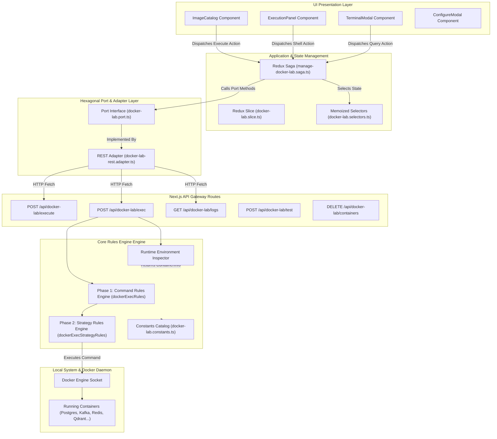
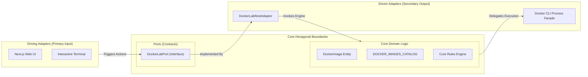
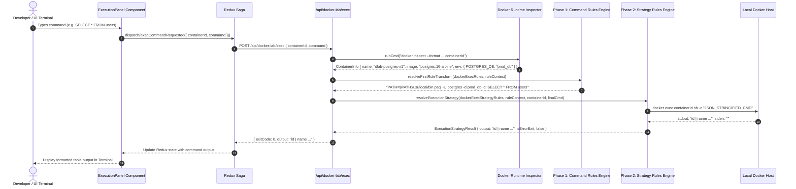

# Docker Lab Extreme-Scale Architecture & Multi-Phase Rules Engine

## Table of Contents
1. [Executive Summary & Core Objectives](#1-executive-summary--core-objectives)
2. [High-Level Design (HLD)](#2-high-level-design-hld)
   - [2.1 Detailed System Component & Data Flow Architecture](#21-detailed-system-component--data-flow-architecture)
   - [2.2 Hexagonal Ports & Adapters Architecture](#22-hexagonal-ports--adapters-architecture)
   - [2.3 End-to-End Execution Sequence Diagram](#23-end-to-end-execution-sequence-diagram)
   - [2.4 Live Container Lifecycle & Dynamic Environment Inspection](#24-live-container-lifecycle--dynamic-environment-inspection)
3. [Low-Level Design (LLD)](#3-low-level-design-lld)
   - [3.1 Two-Phase Rules Engine Execution Decision Tree](#31-two-phase-rules-engine-execution-decision-tree)
   - [3.2 Constants Architecture & Schema Definitions](#32-constants-architecture--schema-definitions)
   - [3.3 Phase 1: Command Transformation Rules Engine](#33-phase-1-command-transformation-rules-engine)
   - [3.4 Phase 2: Execution Strategy & Post-Processing Engine](#34-phase-2-execution-strategy--post-processing-engine)
   - [3.5 API Route Specifications](#35-api-route-specifications)
4. [Detailed Rule Matrix for All 47+ Infrastructure Images](#4-detailed-rule-matrix-for-all-47-infrastructure-images)
5. [Complete Core Algorithms & Pseudocodes](#5-complete-core-algorithms--pseudocodes)
   - [Algorithm 1: `resolveFirstRuleTransform`](#algorithm-1-resolvefirstruletransform)
   - [Algorithm 2: `resolveExecutionStrategy`](#algorithm-2-resolveexecutionstrategy)
   - [Algorithm 3: `inspectContainer`](#algorithm-3-inspectcontainer)
   - [Algorithm 4: API Endpoint Pipeline](#algorithm-4-api-endpoint-pipeline)
6. [Production Verification & Maintenance](#6-production-verification--maintenance)

---

## 1. Executive Summary & Core Objectives

The **Docker Lab Engine** within `infra-gateway` provides an interactive, zero-lock-in orchestration and debugging platform for 47+ enterprise infrastructure Docker images across 8 major domains (Databases, Messaging, Observability, Search Engines, Proxy & Gateways, Security & Identity, AI & Vector DBs, and Dev/Cloud Infrastructure).

### Key Architectural Pillars:
1. **Zero Hardcoded Assumptions**: All database names, usernames, passwords, port mappings, and credentials are dynamically inspected at runtime via `docker inspect`.
2. **Dual-Phase Declarative Rules Engine**: Command processing is split into Phase 1 (Command Syntax & CLI Transformation) and Phase 2 (Base Image Execution Strategy & Error Exit Determination).
3. **Hexagonal Architecture**: Absolute separation between Domain (Entities, Catalog), Ports (Interfaces), Adapters (REST HTTP, Docker CLI facade), Application (Sagas, Slice, Selectors), and UI Components.
4. **Universal Native CLI Routing**: Every container command automatically leverages native tools (`psql`, `mysql`, `clickhouse-client`, `redis-cli`, `mongosh`, `kafka-topics.sh`, `cqlsh`, `awslocal`, `kc.sh`, `vault`, etc.).

---

## 2. High-Level Design (HLD)

### 2.1 Detailed System Component & Data Flow Architecture



### 2.2 Hexagonal Ports & Adapters Architecture



### 2.3 End-to-End Execution Sequence Diagram



### 2.4 Live Container Lifecycle & Dynamic Environment Inspection

```mermaid
flowchart TD
    Start([User Clicks 'Execute Selected']) --> BuildRunCmd[Build docker run Command with Host Port Allocation]
    BuildRunCmd --> ExecDockerRun[Execute `docker run -d --name dlab-image-xxxx -p hostPort:containerPort`]
    ExecDockerRun --> InspectID[Run `docker inspect --format '{{.ID}}'`]
    InspectID --> GetShortID[Extract 12-character Hex Container ID]
    GetShortID --> StartLogPoll[Initiate Polling `GET /api/docker-lab/logs?containerId=shortID`]
    GetShortID --> ProbeHealth[Run Health Check `POST /api/docker-lab/test`]
    
    ProbeHealth --> CheckStatus{Probe Passed?}
    CheckStatus -- Yes --> MarkRunning[Mark Container Status: 'running']
    CheckStatus -- No --> RetryProbe[Retry TCP / HTTP / Exec Probe]
    RetryProbe --> MarkRunning

    MarkRunning --> ExecUserCmd[User Sends Shell Command]
    ExecUserCmd --> InspectEnv[Inspect Container Env: POSTGRES_DB, MYSQL_USER...]
    InspectEnv --> Phase1Transform[Phase 1 Transformation: psql, mysql, redis-cli, kafka-topics.sh]
    Phase1Transform --> Phase2Strategy[Phase 2 Strategy: Distroless vs Shell Wrapper]
    Phase2Strategy --> ReturnOutput[Return Execution Output]

    ReturnOutput --> UserDelete[User Clicks Stop Container]
    UserDelete --> ExecDockerRM[Execute `docker rm -f containerId`]
    ExecDockerRM --> StopLogs[Filter Log API Response to Empty Array `[]`]
    StopLogs --> End([Container Stopped & Cleaned])
```

---

## 3. Low-Level Design (LLD)

### 3.1 Two-Phase Rules Engine Execution Decision Tree

```mermaid
flowchart TD
    Input([Incoming Command Payload: containerId, rawCommand]) --> Inspect[Inspect Container via docker inspect]
    Inspect --> CreateCtx[Create RuleContext: name, image, env, rawCommand, codeLines, isSql]
    
    CreateCtx --> Phase1Filter[Filter Active Rules: rule.enabled == true]
    Phase1Filter --> Phase1Sort[Sort Rules by Priority Descending: 100 -> 90 -> 10]
    Phase1Sort --> Phase1Loop{Evaluate rule.condition(ctx)}
    
    Phase1Loop -- Matches Postgres SQL --> TransformPostgres[Transform: psql -U pgUser -d pgDb -c "SQL"]
    Phase1Loop -- Matches MySQL SQL --> TransformMySQL[Transform: mysql -u user -pPass db -e "SQL"]
    Phase1Loop -- Matches Redis Cmd --> TransformRedis[Transform: redis-cli cmd]
    Phase1Loop -- Matches Mongo Cmd --> TransformMongo[Transform: mongosh --eval "query"]
    Phase1Loop -- Matches Kafka Cmd --> TransformKafka[Transform: kafka-topics.sh --list / --create]
    Phase1Loop -- Matches Fallback --> TransformFallback[Transform: PATH=$PATH:/opt/kafka/bin:/usr/local/bin ...]

    TransformPostgres --> Phase2Start[Pass Transformed Command to Phase 2 Execution Strategy]
    TransformMySQL --> Phase2Start
    TransformRedis --> Phase2Start
    TransformMongo --> Phase2Start
    TransformKafka --> Phase2Start
    TransformFallback --> Phase2Start

    Phase2Start --> CheckDistroless{Is Distroless Base Image? (SurrealDB, Kratos)}
    CheckDistroless -- Yes --> StrategyDirect[Execute Strategy: Direct docker exec containerId finalCmd]
    CheckDistroless -- No --> StrategyShell[Execute Strategy: docker exec containerId sh -c JSON_CMD]
    
    StrategyShell --> CheckFallback{Executable Not Found?}
    CheckFallback -- Yes --> RetryDirect[Retry: Direct docker exec containerId finalCmd]
    CheckFallback -- No --> EvaluateError
    RetryDirect --> EvaluateError
    StrategyDirect --> EvaluateError

    EvaluateError[Evaluate Exit Signatures: psql error, ERROR 1045, command not found] --> BuildResponse[Return { exitCode, output }]
```

### 3.2 Constants Architecture & Schema Definitions

All identifiers and categories are declared as immutable const maps in `src/features/docker-lab/constants/docker-lab.constants.ts`:

```typescript
export const IMAGE_IDS = {
  REDIS: "redis", POSTGRES: "postgres", MYSQL: "mysql", MARIADB: "mariadb",
  MONGODB: "mongodb", INFLUXDB: "influxdb", CASSANDRA: "cassandra", COCKROACHDB: "cockroachdb",
  TIMESCALEDB: "timescaledb", SCYLLADB: "scylladb", SURREALDB: "surrealdb", CLICKHOUSE: "clickhouse",
  NEO4J: "neo4j", QDRANT: "qdrant", MILVUS: "milvus", WEAVIATE: "weaviate", CHROMA: "chroma",
  KAFKA: "kafka", RABBITMQ: "rabbitmq", NATS: "nats", PULSAR: "pulsar", ZOOKEEPER: "zookeeper",
  SCHEMA_REGISTRY: "schema-registry", KAFKA_UI: "kafka-ui", MOSQUITTO: "mosquitto",
  GRAFANA: "grafana", PROMETHEUS: "prometheus", JAEGER: "jaeger", TEMPO: "tempo", LOKI: "loki",
  OPENTELEMETRY_COLLECTOR: "opentelemetry-collector", ZIPKIN: "zipkin", ALERTMANAGER: "alertmanager",
  VECTOR: "vector", ELASTICSEARCH: "elasticsearch", KIBANA: "kibana", OPENSEARCH: "opensearch",
  MEILISEARCH: "meilisearch", TYPESENSE: "typesense", NGINX: "nginx", TRAEFIK: "traefik",
  ENVOY: "envoy", HAPROXY: "haproxy", CADDY: "caddy", KONG: "kong", VAULT: "vault",
  KEYCLOAK: "keycloak", ORY_KRATOS: "ory-kratos", MINIO: "minio", JENKINS: "jenkins",
  CONSUL: "consul", ETCD: "etcd", LOCALSTACK: "localstack"
} as const;

export const CATEGORIES = {
  DATABASES: "Databases", MESSAGING: "Messaging & Streaming",
  OBSERVABILITY: "Observability & Tracing", SEARCH: "Search Engines",
  PROXY: "Proxy & Gateway", SECURITY: "Security & Identity",
  AI_VECTOR: "AI & Vector DBs", INFRASTRUCTURE: "Dev & Infrastructure"
} as const;
```

### 3.3 Phase 1: Command Transformation Rules Engine

Commands pass through `resolveFirstRuleTransform(dockerExecRules, ruleContext)`:
- Rule priorities range from `100` (Critical image match) to `10` (Fallback PATH expansion).
- Standardizes raw user input, SQL queries, and CLI invocations into fully formatted shell commands.

### 3.4 Phase 2: Execution Strategy & Post-Processing Engine

Evaluated by `resolveExecutionStrategy(dockerExecStrategyRules, ruleContext, containerId, finalCmd)`:
- Handles distroless images (e.g. SurrealDB) that lack `/bin/sh` by executing directly.
- Handles standard Linux base images using `docker exec containerId sh -c ...` with fallback retry logic.
- Evaluates exit codes based on image-specific error signatures (`psql: error:`, `ERROR 1045`, `command not found`).

---

## 4. Detailed Rule Matrix for All 47+ Infrastructure Images

| Image ID | Category | Official Docker Hub URL | Native CLI / Health Target | Transformation Strategy |
|---|---|---|---|---|
| `redis` | Databases | `https://hub.docker.com/_/redis` | `redis-cli` | Auto-routes `PING`, `SET`, `GET`, `KEYS *` to `redis-cli <cmd>` |
| `postgres` | Databases | `https://hub.docker.com/_/postgres` | `psql` | Auto-wraps raw SQL into `psql -U ${env.POSTGRES_USER} -d ${env.POSTGRES_DB} -c "..."` |
| `mysql` | Databases | `https://hub.docker.com/_/mysql` | `mysql` | Auto-wraps raw SQL into `mysql -u ${env.MYSQL_USER} -p${pass} ${db} -e "..."` |
| `mariadb` | Databases | `https://hub.docker.com/_/mariadb` | `mariadb` | Auto-wraps raw SQL into `mariadb -u ${user} -p${pass} -e "..."` |
| `mongodb` | Databases | `https://hub.docker.com/_/mongo` | `mongosh` / `mongo` | Auto-wraps JS queries into `mongosh --eval "..."` |
| `clickhouse` | Databases | `https://hub.docker.com/r/clickhouse/clickhouse-server` | `clickhouse-client` | Auto-wraps SQL into `clickhouse-client -q "..."` |
| `surrealdb` | Databases | `https://hub.docker.com/r/surrealdb/surrealdb` | `/surreal` | Executes `/surreal sql --endpoint ...` (Distroless strategy) |
| `cassandra` | Databases | `https://hub.docker.com/_/cassandra` | `cqlsh` | Auto-wraps CQL into `/opt/cassandra/bin/cqlsh -e "..."` |
| `cockroachdb` | Databases | `https://hub.docker.com/r/cockroachdb/cockroach` | `cockroach sql` | Auto-wraps SQL into `/cockroach/cockroach sql --insecure -e "..."` |
| `timescaledb` | Databases | `https://hub.docker.com/r/timescale/timescaledb` | `psql` | Auto-wraps SQL into `psql -U ${user} -d ${db} -c "..."` |
| `scylladb` | Databases | `https://hub.docker.com/r/scylladb/scylla` | `cqlsh` | Executes `/usr/bin/cqlsh <cmd>` |
| `influxdb` | Databases | `https://hub.docker.com/_/influxdb` | `influx` | Routes commands to `/usr/bin/influx` |
| `neo4j` | Databases | `https://hub.docker.com/_/neo4j` | `cypher-shell` | Auto-wraps Cypher queries into `cypher-shell -u neo4j -p pass "..."` |
| `qdrant` | AI & Vector DBs | `https://hub.docker.com/r/qdrant/qdrant` | `/readyz` | Routes REST requests & probes to `http://localhost:6333/readyz` |
| `milvus` | AI & Vector DBs | `https://hub.docker.com/r/milvusdb/milvus` | `/healthz` | Routes health check to `http://localhost:9091/healthz` |
| `weaviate` | AI & Vector DBs | `https://hub.docker.com/r/semitechnologies/weaviate` | `/v1/.well-known/ready` | Routes ready check to `http://localhost:8080/v1/.well-known/ready` |
| `chroma` | AI & Vector DBs | `https://hub.docker.com/r/chromadb/chroma` | `/api/v1/heartbeat` | Routes heartbeat check to `http://localhost:8000/api/v1/heartbeat` |
| `kafka` | Messaging | `https://hub.docker.com/r/apache/kafka` | `kafka-topics.sh` | Expands `/opt/kafka/bin` PATH for `topics`, `produce`, `consume` |
| `rabbitmq` | Messaging | `https://hub.docker.com/_/rabbitmq` | `rabbitmqctl` | Routes `status`, `queues` to `rabbitmqctl status` |
| `pulsar` | Messaging | `https://hub.docker.com/r/apachepulsar/pulsar` | `pulsar-admin` | Expands `/pulsar/bin` PATH for `pulsar-admin` |
| `nats` | Messaging | `https://hub.docker.com/_/nats` | `nats-server` | Routes execution to `nats-server` |
| `zookeeper` | Messaging | `https://hub.docker.com/_/zookeeper` | `zkCli.sh` | Expands `/apache-zookeeper/bin` PATH |
| `schema-registry` | Messaging | `https://hub.docker.com/r/confluentinc/cp-schema-registry` | `/subjects` | Routes schema queries to `http://localhost:8081/subjects` |
| `kafka-ui` | Messaging | `https://hub.docker.com/r/provectuslabs/kafka-ui` | `/actuator/health` | Routes actuator probe to `http://localhost:8080/actuator/health` |
| `mosquitto` | Messaging | `https://hub.docker.com/_/eclipse-mosquitto` | `mosquitto_sub` | Expands `/usr/local/bin` PATH for MQTT scripts |
| `grafana` | Observability | `https://hub.docker.com/r/grafana/grafana` | `grafana-cli` | Expands `/usr/share/grafana/bin` PATH |
| `prometheus` | Observability | `https://hub.docker.com/r/prom/prometheus` | `promtool` | Expands `/bin:/usr/local/bin` PATH for `promtool` |
| `jaeger` | Observability | `https://hub.docker.com/r/jaegertracing/all-in-one` | UI Port 16686 | Health check via `http://localhost:16686` |
| `tempo` | Observability | `https://hub.docker.com/r/grafana/tempo` | `/ready` | Health check via `http://localhost:3200/ready` |
| `loki` | Observability | `https://hub.docker.com/r/grafana/loki` | `/ready` | Health check via `http://localhost:3100/ready` |
| `opentelemetry-collector` | Observability | `https://hub.docker.com/r/otel/opentelemetry-collector-contrib` | `otelcol-contrib` | Expands `/` PATH for `otelcol-contrib` |
| `zipkin` | Observability | `https://hub.docker.com/r/openzipkin/zipkin` | `/health` | Health check via `http://localhost:9411/health` |
| `alertmanager` | Observability | `https://hub.docker.com/r/prom/alertmanager` | `alertmanager` | Expands `/bin` PATH |
| `vector` | Observability | `https://hub.docker.com/r/timberio/vector` | `vector` | Expands `/usr/local/bin` PATH |
| `elasticsearch` | Search Engines | `https://hub.docker.com/_/elasticsearch` | `/_cluster/health` | Routes `health` -> `curl http://localhost:9200/_cluster/health` |
| `kibana` | Search Engines | `https://hub.docker.com/_/kibana` | `/api/status` | Routes status -> `curl http://localhost:5601/api/status` |
| `opensearch` | Search Engines | `https://hub.docker.com/r/opensearchproject/opensearch` | HTTP Port 9200 | Routes cluster check to `http://localhost:9200` |
| `meilisearch` | Search Engines | `https://hub.docker.com/r/getmeili/meilisearch` | `/health` | Health check via `http://localhost:7700/health` |
| `typesense` | Search Engines | `https://hub.docker.com/r/typesense/typesense` | `/health` | Health check via `http://localhost:8108/health` |
| `nginx` | Proxy & Gateway | `https://hub.docker.com/_/nginx` | `nginx` | Expands `/usr/sbin:/usr/local/nginx/sbin` PATH |
| `traefik` | Proxy & Gateway | `https://hub.docker.com/_/traefik` | `traefik` | Expands `/` PATH |
| `envoy` | Proxy & Gateway | `https://hub.docker.com/r/envoyproxy/envoy` | `envoy` | Expands `/usr/local/bin` PATH |
| `haproxy` | Proxy & Gateway | `https://hub.docker.com/_/haproxy` | `haproxy` | Expands `/usr/local/sbin` PATH |
| `caddy` | Proxy & Gateway | `https://hub.docker.com/_/caddy` | `caddy` | Expands `/usr/bin` PATH |
| `kong` | Proxy & Gateway | `https://hub.docker.com/_/kong` | `kong` | Expands `/usr/local/bin` PATH |
| `vault` | Security & Identity | `https://hub.docker.com/_/vault` | `vault` | Sets `VAULT_ADDR='http://127.0.0.1:8200'` & runs `vault` |
| `keycloak` | Security & Identity | `https://hub.docker.com/r/quay.io/keycloak/keycloak` | `/opt/keycloak/bin/kc.sh` | Routes CLI calls to `/opt/keycloak/bin/kc.sh` |
| `ory-kratos` | Security & Identity | `https://hub.docker.com/r/oryd/kratos` | `kratos` | Expands `/` PATH for `kratos` |
| `minio` | Dev & Infrastructure | `https://hub.docker.com/r/minio/minio` | `minio` | Expands `/opt/bin` PATH |
| `jenkins` | Dev & Infrastructure | `https://hub.docker.com/r/jenkins/jenkins` | `jenkins-plugin-cli` | Expands `/usr/local/bin` PATH |
| `consul` | Dev & Infrastructure | `https://hub.docker.com/_/consul` | `consul` | Expands `/bin` PATH |
| `etcd` | Dev & Infrastructure | `https://hub.docker.com/r/bitnami/etcd` | `etcdctl` | Expands `/usr/local/bin` PATH |
| `localstack` | Dev & Infrastructure | `https://hub.docker.com/r/localstack/localstack` | `awslocal` | Auto-wraps AWS CLI calls to `awslocal` |

---

## 5. Complete Core Algorithms & Pseudocodes

### Algorithm 1: `resolveFirstRuleTransform`
```typescript
/**
 * PSEUDOCODE: Phase 1 Command Transformation Resolution
 * Input: rules: Rule[], ctx: RuleContext
 * Output: Transformed shell command string
 */
function resolveFirstRuleTransform(rules: Rule[], ctx: RuleContext): string {
    const activeRules = rules
        .filter(r => r.enabled === true)
        .sort((a, b) => b.priority - a.priority);

    for (const rule of activeRules) {
        if (rule.condition(ctx) === true) {
            if (rule.asyncCheck != null) {
                const asyncOk = await rule.asyncCheck(ctx);
                if (!asyncOk) continue;
            }
            return rule.transform(ctx);
        }
    }
    return ctx.rawCommand;
}
```

### Algorithm 2: `resolveExecutionStrategy`
```typescript
/**
 * PSEUDOCODE: Phase 2 Execution Strategy & Post-Processing
 * Input: strategyRules: ExecutionStrategyRule[], ctx: RuleContext, containerId: string, finalCmd: string
 * Output: ExecutionStrategyResult { stdout, stderr, isErrorExit, output }
 */
function resolveExecutionStrategy(
    strategyRules: ExecutionStrategyRule[],
    ctx: RuleContext,
    containerId: string,
    finalCmd: string
): ExecutionStrategyResult {
    const active = strategyRules
        .filter(r => r.enabled === true)
        .sort((a, b) => b.priority - a.priority);

    for (const rule of active) {
        if (rule.condition(ctx) === true) {
            return await rule.execute(ctx, containerId, finalCmd);
        }
    }
    return await defaultFallbackStrategy(ctx, containerId, finalCmd);
}
```

### Algorithm 3: `inspectContainer`
```typescript
/**
 * PSEUDOCODE: Live Container Dynamic Inspection
 * Input: containerId: string
 * Output: ContainerInfo { name, image, env }
 */
function inspectContainer(containerId: string): ContainerInfo {
    const rawOut = await runCmd(`docker inspect --format '{{.Name}}|{{.Config.Image}}|{{range .Config.Env}}{{.}};{{end}}' ${containerId}`);
    const parts = rawOut.stdout.trim().split("|");
    
    const name = parts[0].replace(/^\//, "");
    const image = parts[1];
    const envEntries = parts[2].split(";").filter(Boolean);
    
    const envMap = {};
    for (const entry of envEntries) {
        const [key, val] = entry.split("=");
        if (key) envMap[key] = val;
    }
    
    return { name, image, env: envMap };
}
```

### Algorithm 4: API Endpoint Pipeline
```typescript
/**
 * PSEUDOCODE: Main Endpoint Controller (/api/docker-lab/exec)
 */
async function POST(request: Request) {
    const { containerId, command } = await request.json();
    
    // 1. Live Runtime Inspection
    const info = await inspectContainer(containerId);
    const ctx = createRuleContext(info, command);
    
    // 2. Phase 1 Rule Engine: Command Transformation
    const finalCmd = await resolveFirstRuleTransform(dockerExecRules, ctx);
    
    // 3. Phase 2 Rule Engine: Strategy Execution & Post-Processing
    const result = await resolveExecutionStrategy(dockerExecStrategyRules, ctx, containerId, finalCmd);
    
    // 4. Client Response
    return Response.json({
        exitCode: result.isErrorExit ? 1 : 0,
        output: result.output
    });
}
```

---

## 6. Production Verification & Maintenance

1. **Automated Compilation Guarantee**: Every code change is verified with `npm run build` using Next.js Turbopack compiler.
2. **Container Cleanup Protocol**: Managed containers carry `--label managed-by=infra-gateway-docker-lab` and are automatically stopped and removed upon container deletion requests.
3. **Log Stream Safeguard**: `GET /api/docker-lab/logs` detects deleted container IDs and returns `[]` empty arrays to avoid leaking daemon error tracebacks to the UI log view.
