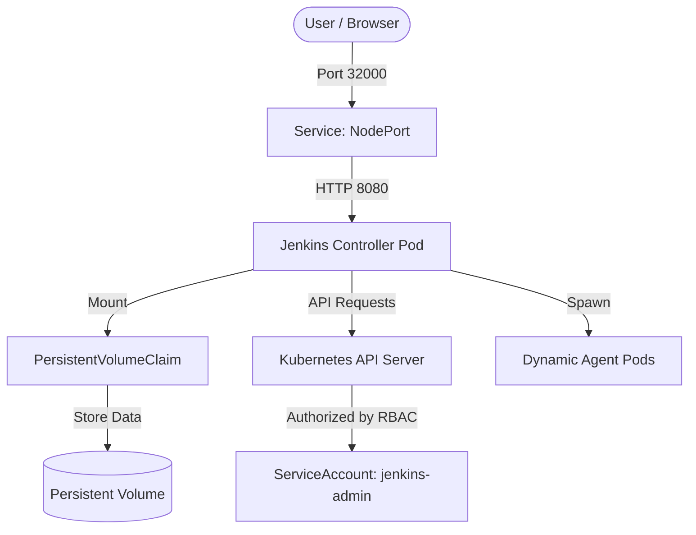

# Jenkins on Kubernetes (K8s) Setup

This directory contains the Kubernetes manifests required to run a Kubernetes-native Jenkins instance using Kustomize.

## Directory Structure

```
deploy/kubernetes/
├── base/
│   ├── kustomization.yaml
│   ├── namespace.yaml
│   ├── volume.yaml
│   ├── service-account.yaml
│   ├── deployment.yaml
│   ├── service.yaml
│   ├── network-policy.yaml
│   └── pdb.yaml
└── overlays/
    ├── dev/
    │   └── kustomization.yaml
    └── prod/
        ├── kustomization.yaml
        └── hpa.yaml
```

---

## How Kubernetes Works in This Setup

This setup uses a **Kubernetes-Native** architecture. Here is a breakdown of how the different Kubernetes components interact to run Jenkins securely and dynamically:



### 1. The Controller & Storage (Stateful Components)
* **Namespace (`namespace.yaml`)**: Creates an isolated sandbox named `jenkins` to prevent Jenkins resources from interfering with other applications running in the cluster.
* **PersistentVolumeClaim (`volume.yaml`)**: Requests persistent storage (10Gi) from the cluster. When the Jenkins Controller pod runs, it mounts this volume to `/var/jenkins_home`. This ensures your jobs, configurations, and plugins **survive container restarts and cluster shutdowns**.
* **Deployment (`deployment.yaml`)**: Defines the Jenkins controller pod configuration (using the Java 21 image). It enforces strict resource limits (limits CPU to 2 cores and memory to 4Gi) and sets up readiness/liveness health probes.

### 2. Network Exposure & Security
* **Service (`service.yaml`)**: Acts as a stable network endpoint. Since pods are ephemeral (their IP addresses change when recreated), the Service provides a permanent entry point:
  - Port `8080` (mapped to NodePort `32000`) for the web interface.
  - Port `50000` (mapped to NodePort `32500`) for agent node communication.
* **NetworkPolicy (`network-policy.yaml`)**: Enforces zero-trust isolation. By default, it blocks all inbound and outbound traffic (`default-deny-all`), and then explicitly allows only required traffic (DNS, outbound web access for updates, and local agent communication).

### 3. Dynamic Agent Orchestration (RBAC)
* **ServiceAccount & RBAC (`service-account.yaml`)**: Jenkins needs to talk to the Kubernetes API to spin up new pods for build jobs. We create a `jenkins-admin` ServiceAccount and bind it to a `ClusterRole` that grants permission to create, list, and delete Pods. The Jenkins controller pod runs using this identity.

### 4. Environments Separation (Kustomize)
* **Base & Overlays**: The files in `base/` define the default config. 
  - The **`dev` overlay** applies the config as-is.
  - The **`prod` overlay** overrides configurations specifically for production: it pins the image to an immutable `sha256` digest and adds a **HorizontalPodAutoscaler (`hpa.yaml`)** to scale resources.

---

## How to Apply

### Development Environment
To deploy the dev version:
```bash
kubectl apply -k deploy/kubernetes/overlays/dev
```

### Production Environment
To deploy the production version:
```bash
kubectl apply -k deploy/kubernetes/overlays/prod
```
