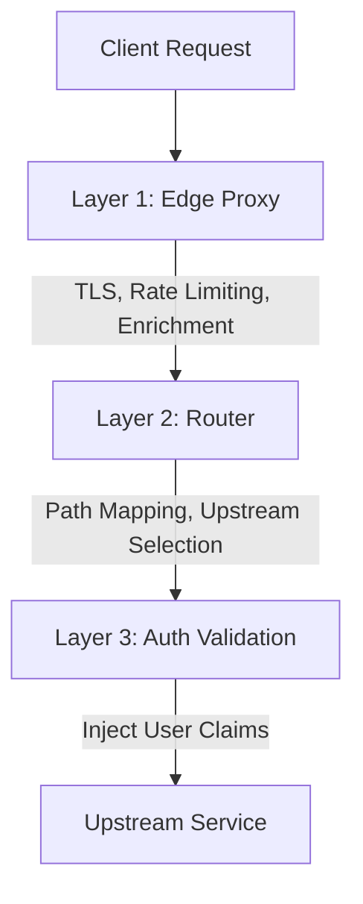

# Traffic Flow Through Gateway

1. **Client** initiates connection to the Edge.
2. **Layer 1** terminates TLS, applies rate limits, injects headers (`X-Request-ID`), and checks IP blacklists.
3. **Layer 2** matches request path against routing patterns and decides target upstream group.
4. **Layer 3** extracts bearer tokens, verifies signatures/expiry, and injects identity context headers.
5. **Upstream** receives fully validated, enriched request.
